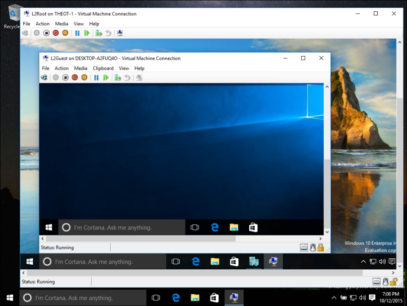

# Introduction to Hyper-V on Windows 10

> Hyper-V replaces Microsoft Virtual PC.

Whether you are a software developer, an IT professional, or a technology enthusiast, many of you need to run multiple operating systems. Hyper-V lets you run multiple operating systems as virtual machines on Windows.

Hyper-V specifically provides hardware virtualization.  That means each virtual machine runs on virtual hardware.  Hyper-V lets you create virtual hard drives, virtual switches, and a number of other virtual devices all of which can be added to virtual machines.

## Reasons to use virtualization

Virtualization allows you to:

* Run software that requires an older versions of Windows or non-Windows operating systems.

* Experiment with other operating systems. Hyper-V makes it very easy to create and remove different operating systems.

* Test software on multiple operating systems using multiple virtual machines. With Hyper-V, you can run them all on a single desktop or laptop computer. These virtual machines can be exported and then imported into any other Hyper-V system, including Azure.

## System requirements

Hyper-V is available on 64-bit versions of Windows 10 Pro, Enterprise, and Education. It is not available on the Home edition.

> Upgrade from Windows 10 Home edition to Windows 10 Pro by opening **Settings** > **Update and Security** > **Activation**. Here you can visit the store and purchase an upgrade.

Most computers will run Hyper-V however each virtual machine is a completely seperate operating system.  You can generally run one or more virtual machines on a computer with 4GB of RAM, though you'll need more resources for additional virtual machines or to install and run resource intense software like games, video editing, or engineering design software.

For more information about Hyper-V's system requirements and how to verify that Hyper-V runs on your machine, see the [Hyper-V Requirements Reference](.\reference\hyper-v-requirements.md).

## Operating systems you can run in a virtual machine

Hyper-V on Windows supports many different operating systems in a virtual machine including various releases of Linux, FreeBSD, and Windows.

As a reminder, you'll need to have a valid license for any operating systems you use in the VMs.

For information about which operating systems are supported as guests in Hyper-V on Windows, see [Supported Windows Guest Operating Systems](supported-guest-os.md) and [Supported Linux Guest Operating Systems](https://docs.microsoft.com/windows-server/virtualization/hyper-v/Supported-Linux-and-FreeBSD-virtual-machines-for-Hyper-V-on-Windows).

## Differences between Hyper-V on Windows and Hyper-V on Windows Server

There are some features that work differently in Hyper-V on Windows than they do in Hyper-V running on Windows Server.

Hyper-V features only available on Windows Server:

* Live migration of virtual machines from one host to another
* Hyper-V Replica
* Virtual Fiber Channel
* SR-IOV networking
* Shared .VHDX

Hyper-V features only available on Windows 10:

* Quick Create and the VM Gallery
* Default network (NAT switch)

The memory management model is different for Hyper-V on Windows. On a server, Hyper-V memory is managed with the assumption that only the virtual machines are running on the server. In Hyper-V on Windows, memory is managed with the expectation that most client machines are running software on host in addition to running virtual machines.

## Limitations

Programs that depend on specific hardware will not work well in a virtual machine. For example, games or applications that require processing with GPUs might not work well. Also, applications relying on sub-10ms timers such as live music mixing applications or high precision times could have issues running in a virtual machine.

In addition, if you have Hyper-V enabled, those latency-sensitive, high-precision applications may also have issues running in the host.  This is because with virtualization enabled, the host OS also runs on top of the Hyper-V virtualization layer, just as guest operating systems do. However, unlike guests, the host OS is special in that it has direct access to all the hardware, which means that applications with special hardware requirements can still run without issues in the host OS.

## Next step

[Install Hyper-V on Windows 10](.\quick-start\enable-hyper-v.md)
