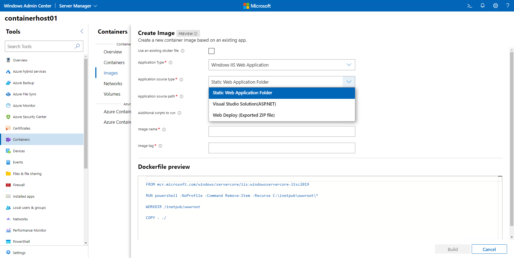

# Create new Container images on Windows Admin Center

This topic describes how to create new container images using Windows Admin Center. Container images are used to create new containers on Windows machines or other cloud services, such as Azure Kubernetes Service. For more information on Windows images, check out the [Container images overview](https://docs.microsoft.com/en-us/virtualization/windowscontainers/about/#container-images).

# Create new container images

When working with containers, you will find yourself writing instructions to Docker on how your container image works so Docker can create a new container image based on these instructions. These instructions are saved on a file called "dockerfile" which is saved on the same folder on which your application resides. 

Windows Admin Center can drastically reduce the overhead of writing these dockerfiles or even completely remove the need to manually write down these files. To get start, on the Containers extension select the option Create New on the Images tab.

The Create new functionality allows for different options while creating a new container image:

- Existing Docker File: This option allows you to rebuild a new container image based on an existing dockerfile. This is very useful when you need to make small changes to an existing dockerfile or simply re-run the container creation to catch an application update.
- IIS Web Application/Static Web Application Folder: This option will create a new container image using the IIS base image and copy the content of a folder to the container image to add it as a web site. No framework is added on this option.
- IIS Web Application/Visual Studio Solution(ASP.Net): This option can be used to create a new container image based on an existing Visual Studio Solution. This option will use a multi-image stage approac to stage the application, compile the necessary binaries and store only the necessary assets on the final image. The ASP.Net container image will be used as base image. This option will also ask for the folder on which the Visual Studio resides and will list the existing projects for you to select which one you'd like to containerize.
- IIS Web Application/Web Deploy (Exported Zip file): This option an be used to create a container image from the artifacts exported from a running server. You can use Web Deploy to expert the application into a Zip file and use Windows Admin Center to create a new container image based on the exported Zip file. The ASP.Net container image wil ne used as base image.

Once you select the initial option of which type of appliation you want to containerize, you can select common options to finalize the creation of your image:

- Framework version: Both the Visual Studio Solution and Web Deploy options will use the ASP.Net image as base for your container image. However, you can select which version of the .Net Framework you want to use in order to accomodate your application.
- Additional scripts to run: This option allows you to select a PowerShell script to be used at build time. Windows Admin Center will add an instruction to the dockerfile to copy the .PS1 file to the container image and run this script when the container image is created. This can be very helpful if your application requires you to run any additional steps that are not contemplated in the application itself.
- Image Name: The final image name to be used. This can be changed later when you push the image to a container registry.
- Image tag: This is used to differentiate multiple versions of the same image. Provide a identifier so your image is properly tagged.

Once you have all the options for your container image selected, you can review the dockerfile. You can also edit the dockerfile by hand if necessary. This dockerfile will be saved on the location of the application you specified in the earlier step. 

>[!Note]
>If a dockerfile exists in the location of the application you are trying to containerize, Windows Admin Center will replace that file with the new one it just created.

## Next steps

> [!div class="nextstepaction"]
> [Run containers on Windows Admin Center](./WAC-Containers.md)
