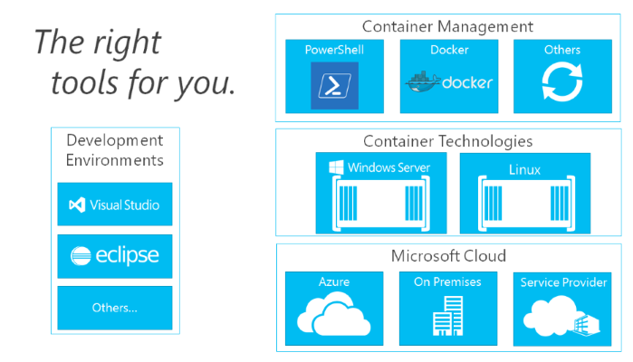

---
title: Container Ecosystem
description: Building a Container Ecosystem.
keywords: metadata, containers
author: PatrickLang
ms.date: 04/20/2016
ms.topic: about-article
ms.prod: windows-containers
ms.service: windows-containers
ms.assetid: 29fbe13a-228a-4eaa-9d4d-90ae60da5965
---
# Build a container ecosystem

To understand why building a container ecosystem is so important, let's first talk about Docker.

## Docker

As you read about containers, you’ll inevitably hear about Docker. Docker is the vessel by which container images are packaged and delivered. This automated process produces images (effectively templates) which may then be run anywhere—on premises, in the cloud, or on a personal machine—as a container.

Just like any other container, a Windows Server Container can be managed with [Docker](https://www.docker.com).

The concept of namespace isolation and resource governance through a container has been around for a long time, going back to BSD Jails, Solaris Zones, and the basic UNIX change root (chroot) mechanism. Docker lays a solid foundation for development through a common toolset, packaging model, and deployment mechanism that simplify the containerization and distribution of applications. These applications can then run anywhere on any Linux host and in Windows.

A ubiquitous packaging model and deployment technology simplifies management by offering the same management commands against any host, creating a unique opportunity for seamless DevOps. You can also create a Docker image that will deploy identically across any environment in seconds, whether it's a developer’s desktop, a testing machine, or a set of production machines. This has created a massive and growing ecosystem of applications packaged in Docker containers with DockerHub, the public containerized application registry that Docker maintains.

Now, let's talk about that ecosystem of applications and how you can build on Docker concepts to create a development and deployment workflow suited to your needs.

## Components of a container ecosystem

Windows containers are a key component of a large container ecosystem. We’re working across the industry to deliver developer choice at each layer of the solution stack.

The container ecosystem provides ways to manage containers, share containers and develop apps that run in containers.

Microsoft wants to empower developer choice and productivity as they build these next-gen apps. Our goal is to fuel developer productivity, which means enabling applications to target any Microsoft cloud without having to modify, rewrite, or reconfigure code.

Microsoft is committed to being open and ecosystem-friendly. We actively support the combination of multiple developer ecosystems of interest, such as Windows and Linux, to drive innovation.

Over the coming months, we will provide more information about additional partners in this developing ecosystem.

## Get started with Docker

To learn how to build containers with Docker, see [Docker Engine on Windows](../manage-docker/configure-docker-daemon.md). You can also visit [the Docker website](https://www.docker.com) for a more in-depth look at how to use Docker.