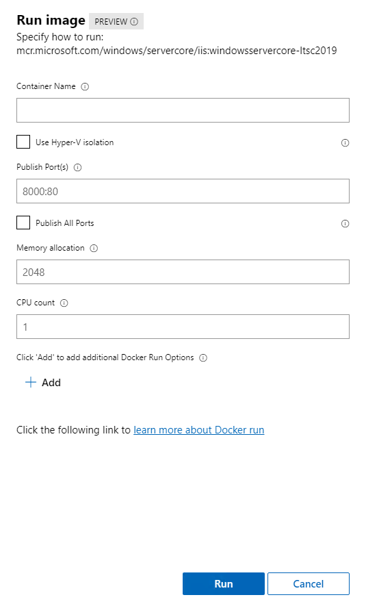
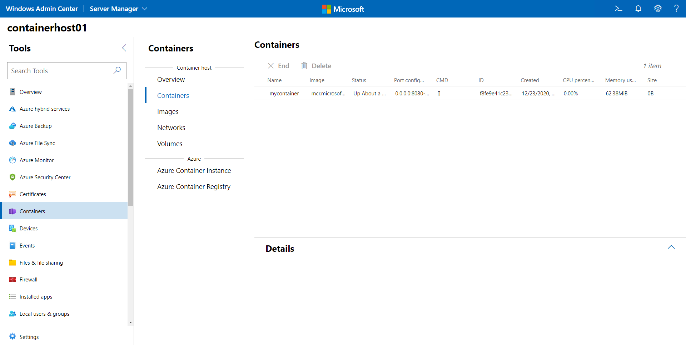

# Run new Containers using Windows Admin Center

Windows Admin Center helps you containers locally on your container host. Using your Windows Admin Center instance with the Containers extension installed, open the container host you want to manage and select the Containers extension on the left-hand side. Click the Images Tab inside under Container Host.

Select the image you want to run and click Run.

On the Run menu you can specify the container related configuration:

- Container name: This is an optional input. You can provide a container name to help you track the container you created - otherwise Docker will provide a generic name to it.
- Isolation type: You can choose to use hypervisor instead of the default process isolation. For more information on isolation modes for Windows Containers, check out the [documentation](https://docs.microsoft.com/en-us/virtualization/windowscontainers/manage-containers/hyperv-container).
- Publish ports: By default, Windows containers use NAT for networking mode. This means a port on the container host will be mapped to the container. This option allows to specify that mapping.
- Memory and cpu allocation: You can specify how much memory and how many CPUs a container should be able to use. This option does not allocate the assigned memory or CPU to the container. Rather, this options specifies the maximuns a container will be able to allocate.
- Add: You can also append Docker run parameters that are not in the UI, such as -v for persistent volume. For more information on available Docker run parameters, check out the [documentation](https://docs.docker.com/engine/reference/commandline/run/).

Once you specified the configuration for the container, click Run. You can check out the status of the running containers on the Containers tab:

## Next steps

> [!div class="nextstepaction"]
> [Manage Azure Container Registry on Windows Admin Center](./wac-acr.md)