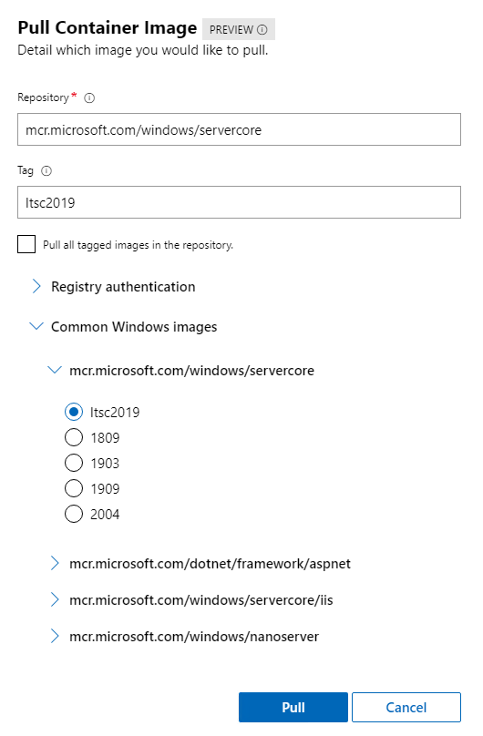

# Manage Container images on Windows Admin Center

This topic describes how to manage container images on Windows Admin Center. Container images are used to create new containers on Windows machines or other cloud services, such as Azure Kubernetes Service. For more information on Windows images, see the [Container images overview](https://docs.microsoft.com/en-us/virtualization/windowscontainers/about/#container-images).

## Pull container images

After deploying a container host, the next step is to pull (or download) container images so new containers can be created from the images. You can use Windows Admin Center to pull new container images by selecting the Containers extension on your targeted container host. Then, select the **Images** tab inside the Container extension under Container Host and select the **Pull** option.

In the **Pull Container Image** settings, provide the image URL and the tag for the image you want to pull. You can also select the option to pull all tagged images on that repository.

If the image you want to pull is on a private repository, provide the username and password to authenticate against that repository. If your repository is hosted on Azure Container Registry, use the native Azure authentication on Windows Admin Center to access the image. This requires the Windows Admin Center instance to be connected to Azure and authenticated with your Azure account. For more information on how to connect a Windows Admin Center instance to Azure, check out the [documentation](https://docs.microsoft.com/en-us/windows-server/manage/windows-admin-center/azure/azure-integration).

If you aren't certain which image to pull, Windows Admin Center provides a list of common images from Microsoft. Select the **Common Windows images** dropdown to see a list of base images that are commonly pulled. Select the image you want to pull, and Windows Admin Center will fill in the repository and tag fields.

## Push container images

Once you have your own container image created, it's a good practice to push that image to a centralized repository to allow other container hosts or cloud services to pull the image.

On the **Images** tab in the Containers extension of Windows Admin Center, select the image you wan to push and click **Push**.

In the **Push Container Image** settings, you can change the image name and tag before pushing (uploading) it. You can also choose whether to push it to either a generic repository or a repository on Azure Container Registry. For a generic repository, you will need to provide a username and password. For Azure Container Registry, you can use the integrated authentication on Windows Admin Center. For Azure, you can also select which subscription and registry you want to push the image to.

## Next steps

> [!div class="nextstepaction"]
> [Create new containers on Windows Admin Center](./wac-images.md) 